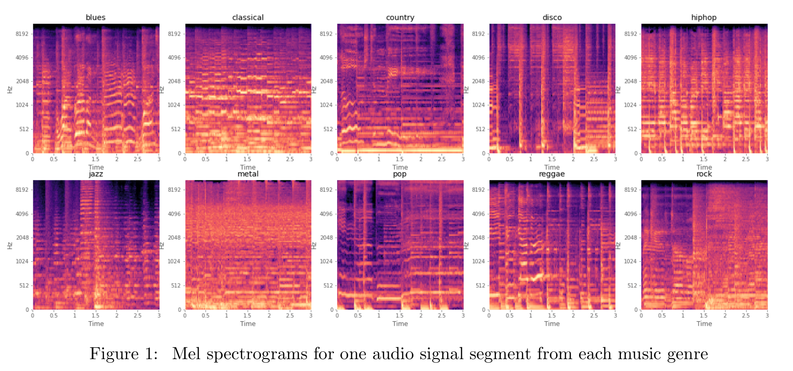
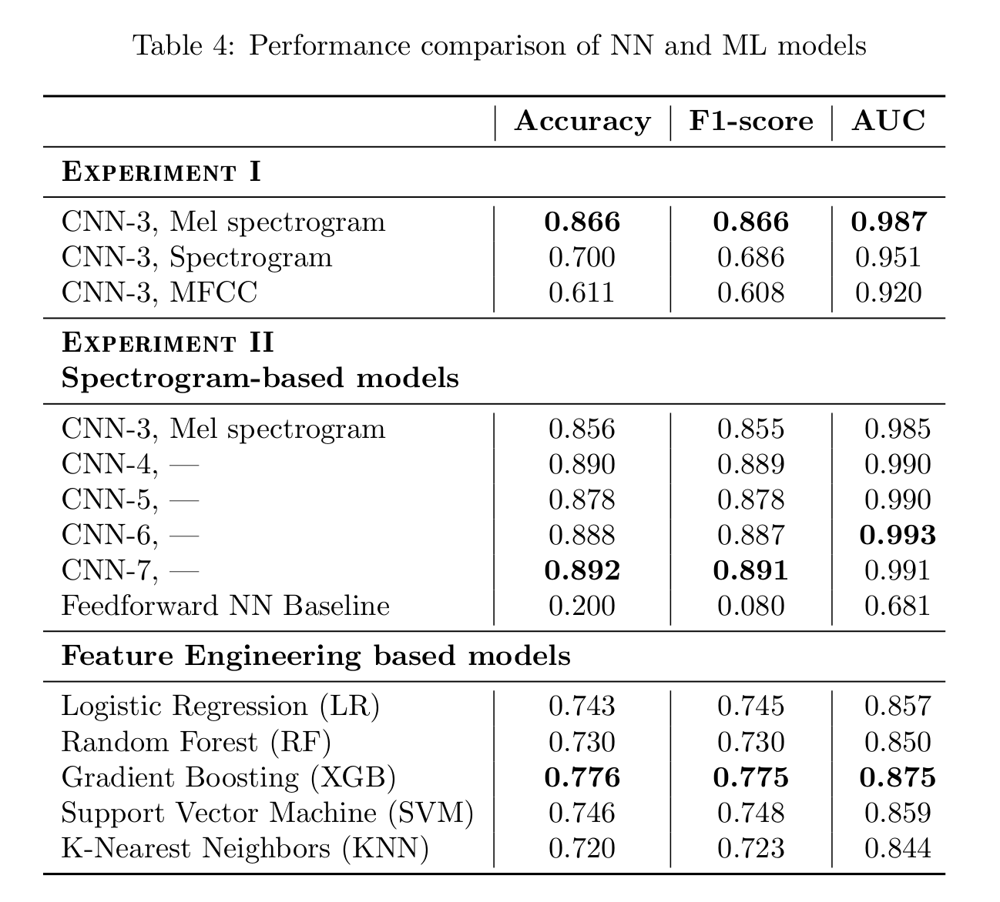
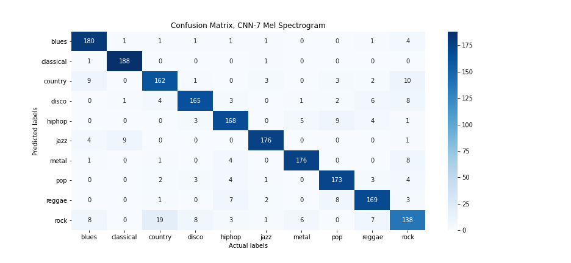
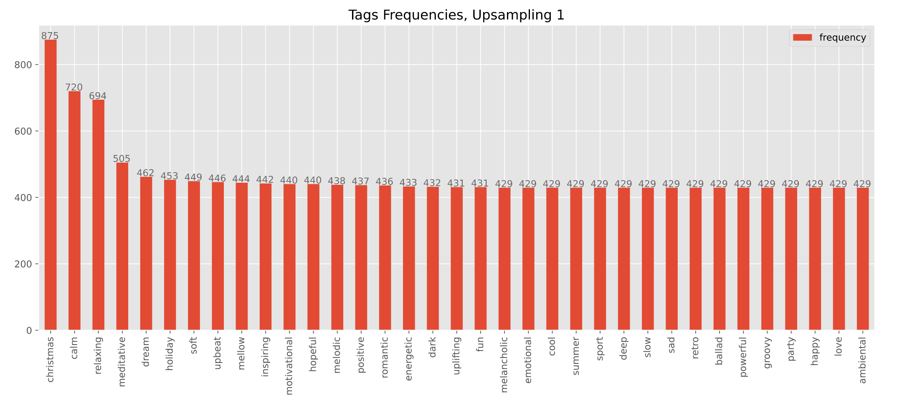
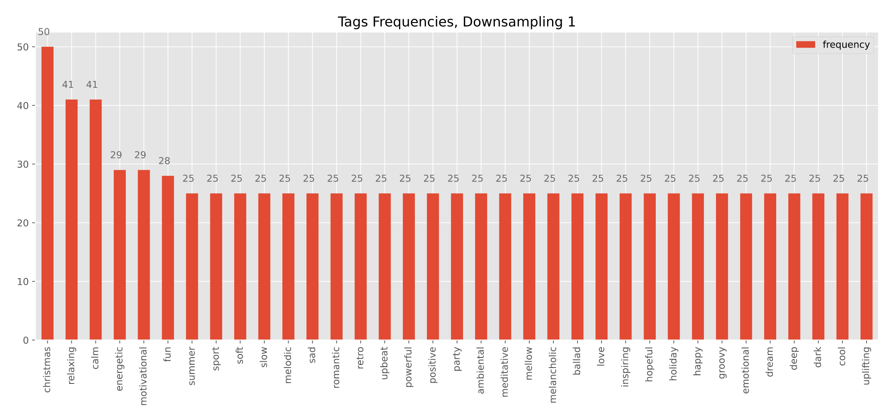
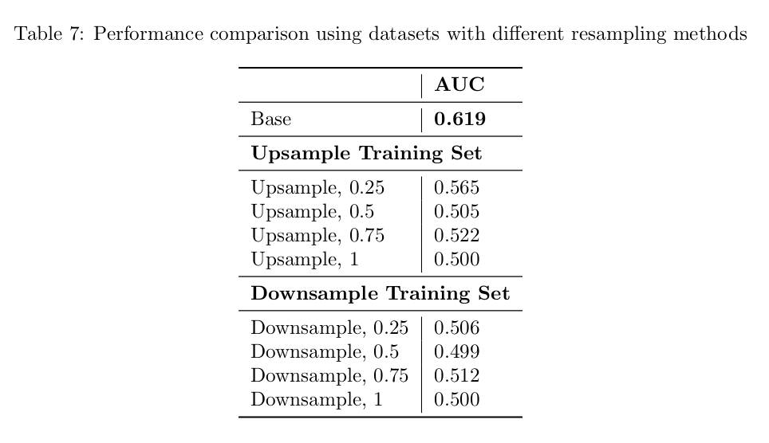

# Deep Learning for Music Classification Tasks

This repository gathers all the work done during my two and a half months remote internship (May 2020 - July 2020). I trained CNN-based models for two classification tasks:
1. Classification by __genre__ on [GTZAN dataset](http://marsyas.info/downloads/datasets.html)
2. Classification by __mood__ on a subset of [MTG-Jamendo dataset](https://mtg.github.io/mtg-jamendo-dataset/) 

A detailed walkthrough of the project can be found in my [report](https://github.com/Elxse/deep-learning-for-music-classification-tasks/blob/master/dl_music_genre_mood.pdf).

## Problem Statement
Music Information Retrieval (MIR) is a large area of research dedicated to trying to extract useful information from music and one of the challenging task for MIR systems is to classify music by genre and mood automatically. An automatic tagging algorithm could be useful for music recommander systems or playlists generators for instance.

The goal of this project is to use a convolutional neural network (CNN) to classify music by genre and mood. 
- For the genre task, a first CNN-based architecture is trained on several audio representations, then using the best one as input of five other architectures with various number of layers to find the best performing model based on accuracy. I compare the CNN-based model to a feedforward neural network (FNN). CNNs have additional layers for edge detection that make them well suited for image classification problems, but they tend to be more computationally expensive than FNNs. If a FNN could perform just as well, there would be no need to use a CNN. We also provide a comparative study between deep learning models which only requires a spectrogram as input and conventional machine learning classifiers which need to be trained with hand-crafted features. Again to see if using a CNN is worthwhile. 
- For the mood task, we focus on handling imbalanced datasets by using resampling methods and we trained several CNNs to determine which dataset leads to the best performance.

## Overview

### Genre ([summary](#summary-genre))

1. [Data Collection](https://github.com/Elxse/deep-learning-for-music-classification-tasks/blob/master/genre-classification/code/1_Data_Collection.ipynb)
2. [Exploratory Data Analysis](https://github.com/Elxse/deep-learning-for-music-classification-tasks/blob/master/genre-classification/code/2_Exploratory_Data_Analysis.ipynb)
3. [Feedforward Baseline](https://github.com/Elxse/deep-learning-for-music-classification-tasks/blob/master/genre-classification/code/3_Feedforward_Baseline.ipynb)
4. [Experiment 1: Different Types of Inputs](https://github.com/Elxse/deep-learning-for-music-classification-tasks/blob/master/genre-classification/code/4.1_Experiment_1_Different_Inputs.ipynb)
5. [Experiment 2: Different Number of Layers](https://github.com/Elxse/deep-learning-for-music-classification-tasks/blob/master/genre-classification/code/4.2_Experiment_2_Number_Layers.ipynb)
6. [Handcrafted Features](https://github.com/Elxse/deep-learning-for-music-classification-tasks/blob/master/genre-classification/code/5_Handcrafted_Features.ipynb)
7. [Machine Learning Classifiers](https://github.com/Elxse/deep-learning-for-music-classification-tasks/blob/master/genre-classification/code/6_Machine_Learning_Classifiers.ipynb)

### Mood ([summary](#summary-mood))

1. [Data Collection](https://github.com/Elxse/deep-learning-for-music-classification-tasks/blob/master/mood-classification/code/1_Data_Collection.ipynb)
2. [Exploratory Data Analysis](https://github.com/Elxse/deep-learning-for-music-classification-tasks/blob/master/mood-classification/code/2_Exploratory_Data_Analysis.ipynb)
3. [Convolutional Neural Network](https://github.com/Elxse/deep-learning-for-music-classification-tasks/blob/master/mood-classification/code/3_CNN.ipynb)

### Dependencies
- Tensorflow
- Keras
- Sklearn
- Librosa

## Executive Summary
First of all, I used Google Colab which allows us to write and execute Python in our
browser with free access to GPUs. Google Colab has a RAM capacity of 12.72 GB but some datasets were still too large to fit into memory. Instead of loading the data in one go, the solution adopted was to break it into chunks with a Python generator. The main advantage of using a generator lies in the fact that each batch won’t occupy the memory until it is necessary, which is very useful in this example where memory is scarce. Concretely, after extracting mel spectrograms, spectrograms, and MFCCs from the
music data, I prepared for each dataset a train, a validation, and a test sets of the filenames. The samples as well as the splits were saved in a .npy format and imported in Google Drive. Then in the notebooks where models are trained, the generator reads a split file and creates mini batches of 128 samples based on the filename contained in the split. Not only it allows us to handle large datasets, but it also permits to train the different models using the same training and validation sets for comparison.

<h3 id="summary-genre">Genre</h3>

#### Data Gathering
The dataset that I used is the GTZAN Genre Collection which was used in a well known paper on genre classification in 2002. It is composed of 1000 audio tracks of 30-second long with 100 samples per genre. All the files came in .wav format, so I was able to use Librosa library to read them and extract all necessary information from each audio file.

The majority of deep learning approaches in MIR take advantages of 2-dimensional representations of the audio signal, such as spectrograms and mel spectrograms. During my research, I also came accros CNNs trained on mel frequency cepstral coefficients (MFCC). Thus, I decided to create three datasets, one for each audio representation, to compare the influence of the input types on the performance of a CNN. To increase the number of samples, I also adopted a multiframe strategy that allows us to extract more than one input data per song. This choice was motivated by the poor results of my models when I trained them on a fraction of the initial number of inputs (1000).

Most of the data processing was done through the use of functions. There is a function to check if the size of spectrograms and mel spectrograms are the same or not. This is important in order to feed them into a neural network. Smaller arrays are padded with zeros to make them all the same size. Then, I wrote a function which computed spectrograms, mel spectrograms and MFCCs for each frame of an audio file, reshaped them so that they were all the same size, and stored them in a `.npy` file. The corresponding genre of each song is indicated in the filename of each resulting `.npy` file. It will help me later to match the file to a genre label during the modelling process.

Lastly, in order to compare the performance of CNNs and shallow machine learning techniques and see if CNNs outperform them indeed, I prepared hand-crafted features to be fed in classifiers. Their values as well as their corresponding file names and genre labels are stored in a `.csv` file.

#### Data Cleaning & EDA

All audio files were all the same length, and we had the same number of excerpt for each genre, so they wasn't much data cleaning to be done. For some exploratory analysis, I plotted one spectrogram, melspectrogram and MFCCs for each genre to visualize them. Seeing differences between gave me confidence that CNNs will perform well.

#### Modelling & Results

I tried several different architectures for both the CNN and FNN. 
The final FNN achieved a training score (accuracy) of 16% and a test score of 20%. It performs slightly better than a "dumb" classifier which assigns all predictions to the same class (accuracy = 10%) but it is still a poor performance. The final CNN (a 7-layer CNN with mel spectrogram input) achieved a training score 92,3% and a test score of 89,2%. There is a bit of overfitting but it is not too bad. Lastly, models based on hand-crafted features have a 74% accuracy in average. As suspected, the CNN did much better! 

To look deeper into what was happening with the model, I computed a confusion matrix to visualize the model's predictions against the actual values. It was interesting to see that the model seems to confuse ’Rock’ music with ’Country’ and ’Blues’ just like how humans would! This can be explained as Rock music has its roots in 1940s and 1950s rock and roll, a style which drew heavily from the genres of blues, rhythm and blues, and from country music.

<h3 id="summary-mood">Mood</h3>

#### Data Gathering and Data Cleaning

For this task, I used the MTG-Jamendo dataset which offers mood as well as theme tags for 18,486 full songs. Tracks can possibly have more than one tag. Due to memory capacity limitations, I only downloaded a subset of it.

Contrary to the GTZAN dataset where all excerpts were of the same length and all genres was equally represented, the subset that I used for the mood task was imbalanced: bigger representation of several tags and songs of different length. To process the imbalance dataset, I firstly removed less frequent tags, then for each song, I discarded its first and last 20 seconds and produced frames of equal-length time. The number of frames per song is inevitably variable. Lastly, I adopted two __resampling methods__ using the resampling module of Scikit-Learn (oversample minority classes and undersample majority classes) to decrease the difference between the most represented tags and less frequent tags. Eight different datasets were generated: one baseline, four based on the upsampling method and four based on the downsampling method. 

The difference between each split lies in the number of samples to resample for
the minority/majority classes.
- For example in the oversampling case, the parameter that controls this
specific number is `upsampling size` which is the percentage of the maximum frequency tag for the minority
classes to match. For instance, if the number of samples of the maximum frequency is 100 and we fix `upsampling size` to 0.4, then each class that has a number of observations less than `100 × upsampling size = 40` will be resampled to match 40.
- In the downsampling case, the parameter downsampling size indicates the proportion of the difference between a chosen class and the
minority class to remove.  For example, if `downsampling size = 0.5`, the number of samples in the minority class is 25, the number of samples in the chosen class is 100, then we remove `difference ×
downsamling size = (100 − 25) × 0.5 = 37` observations from the chosen class.

#### EDA

Here are some examples of the tags repartition in a dataset resulting from a downsampling method, and one from an upsampling method.

#### Modelling & Results

I trained a CNN on the nine different datasets, but the results were not very conclusive. The best score was obtained with the base dataset, the one where I didn't perform any resampling methods.

## Conclusion

- For the first task focusing on classifying music per genre, the experiments were carried with the GTZAN dataset. In Experiment I, it was shown that using mel spectrograms resulted in better performance compared to spectrograms and MFCCs. In Experiment II, different number of layers were evaluated on a bigger dataset which contains approximately twice the number of mel spectrograms. The optimal number of layers were found to be different than in the first experiment. Furthermore, CNN-based models were shown to outperform feedforward neural networks and feature-engineered classifiers that were trained based on time domain and frequency domain features from the audio signals. 

- For the second task on music mood classification, a subset of the MTG-Jamendo Mood Theme dataset was used. Since the dataset was imbalanced, two resampling methods were applied on the training set to rebalance the tags repartition. Ultimately, the best result was obtained with the unmodified training set but overall, the results were not conclusive.
